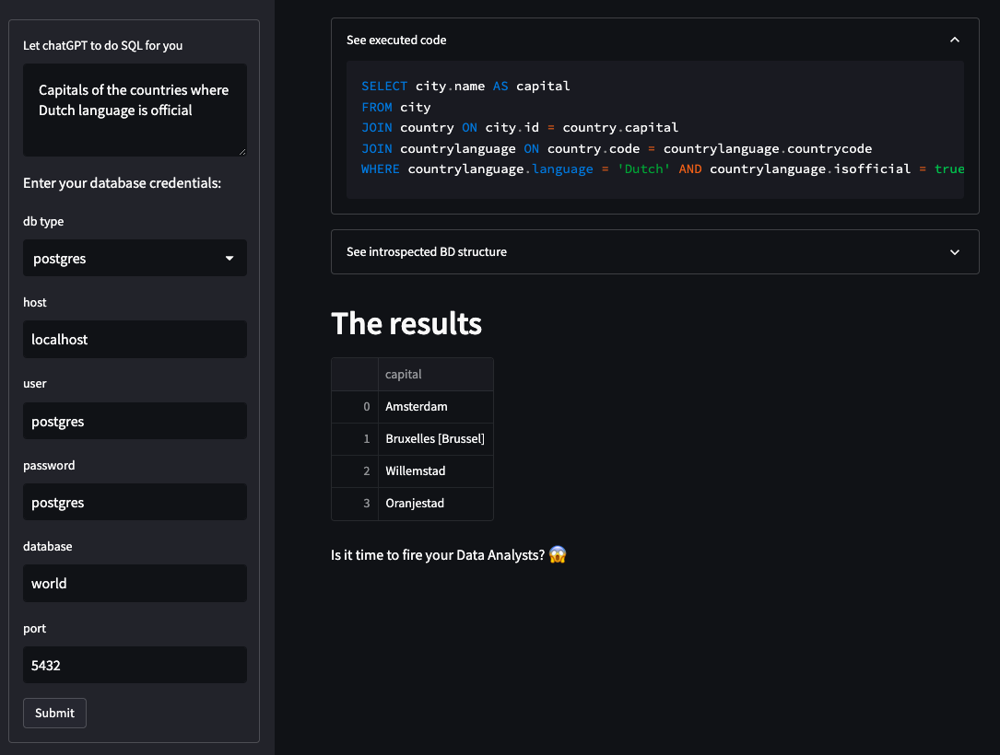
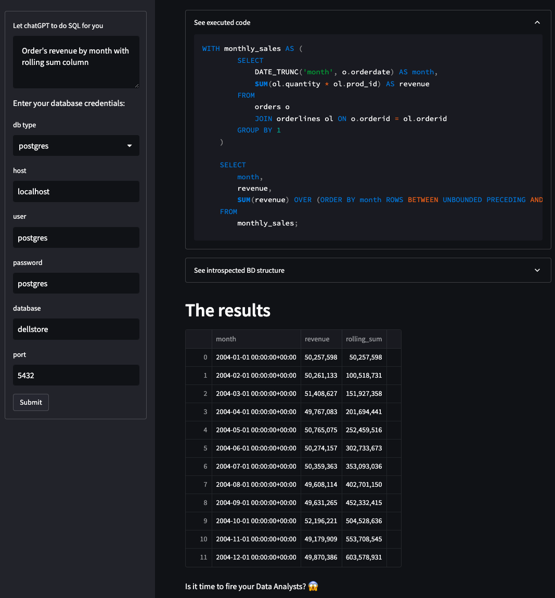
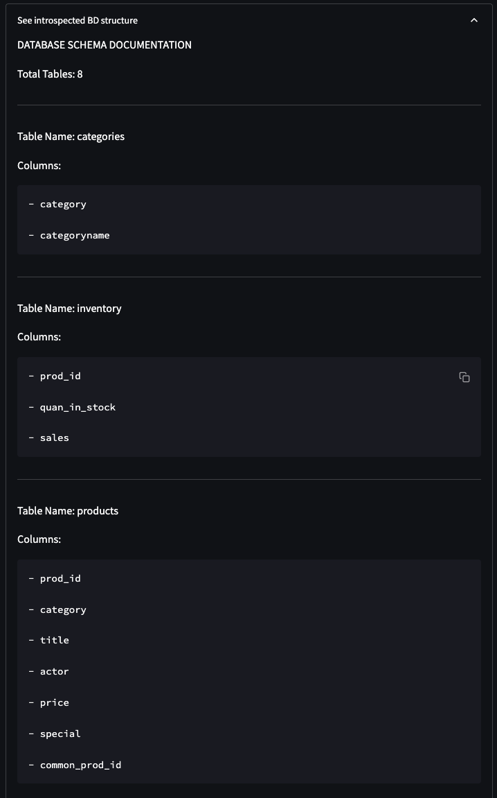

# GPT Data Analyst

 
This app utilizes chatGPT API to introspect a DB and query it using user's prompt. It also utilizes Streamlit as simple UI.

Note: Postgres container with sample data used for preview - [aa8y/postgres-dataset](https://hub.docker.com/r/aa8y/postgres-dataset/)
## Examples
General queries

Finance reports

Additional context parsing like "West states"

On-the-fly schema introspection reference 

